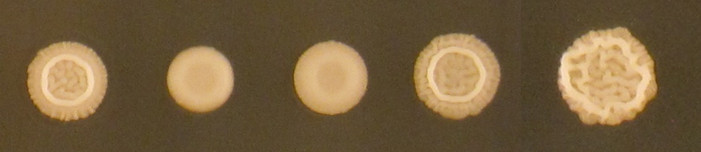

# pnri-projects

This repository houses projects completed in collaboration with the [Dudley lab](https://www.pnri.org/research/labs/dudley-lab/) at Pacific Northwest Research Institute.

The ability to automatically quantify phenotypic traits of microbial communities from images in an accurate and robust manner is crucial to advancing high-throughput genetic studies. Using tools from the python scientific stack, we have developed a flexible, free pipeline to automate the extraction of meaningful quantitative features characterizing colony size, color, morphology, and more from plate images. Check back for the release of PyPl8, a comprehensive package for utilizing these tools.

##

* [**Funnel Cross Project**](https://github.com/lacyk3/pnri-projects/tree/Image-Analysis-Demos/Funnel%20Cross%20Project): This repository contains the jupyter notebooks used to process phenotype images for <`cite paper and include link`>. 
  - `RenameImages.ipynb` was used to rename phenotype images by reading the bar code present in each image and matching it to a human-readable plate name saved in a csv master list.
  - `ExtractValues.ipynb` was used to automatically crop images to the region of interest, segment patches from the background, and extract growth data: the area in pixels and the sum of the intensities of all pixels within the colony. 

## Contributors

* [@lacyk3](https://github.com/lacyk3) 📖

## Contact

If you want to contact me you can reach me at <lacyk3@uw.edu>.

## License
<!--- If you're not sure which open license to use see https://choosealicense.com/--->

This project uses the following license: [<license_name>](<link>).
